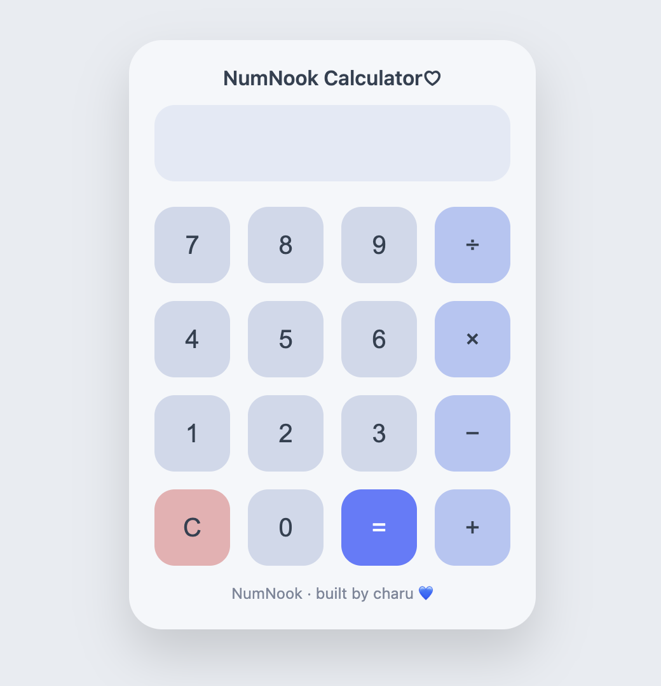

# ⭐️NumNook Calculator

A beautifully designed calculator with a soft blue aesthetic, smooth interactions, and a calm, minimal UI. Built as a personal web project to explore UI design and frontend fundamentals.

## Calculator Preview

## Features

### 🖱 Design
- Soft pastel blue theme
- Rounded buttons with subtle shadows
- Minimal and clean layout
- Calm, cozy UI

### 🖱 Functionality
- Basic arithmetic operations (+, −, ×, ÷)
- Real-time input display
- Clear (C) button
- Error handling for invalid expressions

### 🖱 Interactions
- Button hover and press feedback
- Smooth transitions
- Click-based input

## 🖱 Technologies Used

- HTML5
- CSS
- vanilla JavaScript

## 👩🏻‍💻 Author

Charuvarshini M  
GitHub:@charuvarshini125

NumNook · built by charu 💙
 

